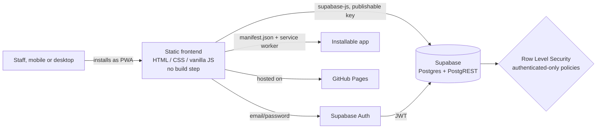

# Parents Break — Operations System

A staffing operations platform built for a real childcare/transport business, replacing a WhatsApp-and-spreadsheets workflow with a single system: candidate intake → structured interviews → active roster → per-family billing, deployed as an installable PWA with zero infrastructure cost.

**Live:** `https://diegomarin28.github.io/sistema-parents-break/`
**Stack:** Vanilla JS · Supabase (Postgres, Auth, RLS) · GitHub Pages · PWA

---

## The problem

Parents Break places sitters and drivers with families. Before this project, every stage of that pipeline lived in a different, disconnected place: candidates applied through a Google Form, got interviewed with notes scattered across chats and spreadsheets, and once hired, their contact info and pay rates lived in yet another sheet — with no way to tell, at a glance, who'd been interviewed, who was active, or what margin a given sitter/family pairing was actually generating.

Nothing was queryable. Nothing had access control. Two non-technical staff were manually reconciling records across documents that routinely drifted out of sync.

I designed and shipped a system that collapses that into one source of truth, built iteratively over a week against a live business that couldn't stop operating while I built it — which shaped a lot of the decisions below more than a green-field spec would have.

## What it does

- **Recruitment pipeline** — candidates enter as `intake` (manual entry, or bulk CSV import from real Google Forms exports, with fuzzy header-matching against ~26 real-world form columns that vary in naming), move through a structured interview with weighted, scored competencies + free-text notes, and either get hired into the active roster or stay on record as evaluated-but-not-hired.
- **Family & pricing management** — many-to-many relationships between families and sitters, each with its own hourly billing rate vs. hourly payout; margin is computed automatically rather than tracked by hand.
- **Installable PWA** — manifest + service worker, so non-technical staff get an app-like icon and standalone window on their phone without any app-store distribution overhead.
- **Auth-gated by default** — every table sits behind Postgres Row Level Security scoped to authenticated staff accounts; there is no client-side-only access control anywhere in the system.

## Architecture



The frontend is a single static HTML file with no framework and no build pipeline — deliberately. The end users needed to be able to redeploy updates themselves (drag-and-drop a file into GitHub's UI) without a CI pipeline or a `node_modules` folder to explain. All state and business logic live in Postgres, not in the client.

## Stack, and why

| Piece | Choice | Why |
|---|---|---|
| Frontend | Vanilla JS, no framework | Zero build step; ships as one static file; trivial to redeploy by non-developers |
| Backend | Supabase (Postgres + PostgREST + Auth) | Real relational schema and SQL, instant REST API, managed auth — without hand-rolling a server for a project this size |
| Access control | Postgres Row Level Security | Enforced at the database layer, not the client — the publishable key is safe to ship in public client code because the database itself refuses reads/writes without a valid authenticated session |
| Hosting | GitHub Pages | Free static hosting straight from the repo; no CI needed at this scale |
| Distribution | PWA (manifest + minimal service worker) | Installable, app-like UX matching actual usage (opened from a phone home screen) without app-store overhead |

## Data model

```
candidatas ──1:N── entrevistas
    │
    ├──1:1 (on hire)── ninieras
    │
familias ──M:N (asignaciones, with per-pair rates)── ninieras
```

**Worth calling out:** the first pass mirrored how the client had been tracking this manually — a candidate got copied into a new record at each pipeline stage (intake sheet → interview sheet → roster sheet). I refactored that into a single `candidatas` table with a `status` enum (`intake → entrevistada → contratada / descartada`) instead, so a person's identity persists through their whole lifecycle rather than being duplicated across stages and risking drift between copies. Interview specifics (scores, red flags, notes) live in a separate `entrevistas` table in a 1:N relationship — that keeps the option open to re-interview someone later without losing prior history, which a flattened single-record model would have made awkward.

Full schema, including the RLS policies, is in [`supabase/schema.sql`](./supabase/schema.sql).

## Running it locally

No `npm install`, no build step.

1. Clone the repo.
2. Create a free [Supabase](https://supabase.com) project.
3. Run [`supabase/schema.sql`](./supabase/schema.sql) against it (SQL editor, or the Supabase CLI).
4. In Supabase → Authentication, manually create your staff user(s) — there's no self-serve signup by design.
5. In `index.html`, swap `SUPABASE_URL` / `SUPABASE_KEY` for your project's values. The publishable/anon key is meant to be public client-side; the security boundary is RLS, not the key.
6. Open `index.html` directly in a browser, or point GitHub Pages at the repo root for a stable URL.

## Demo

*(Add screenshots or a short screen recording here — login screen, the RRHH pipeline board, and the Familias margin view are the three that tell the story fastest.)*

## What I'd change next

- Move the two Supabase credentials out of a hardcoded constant, if this ever outgrows a single-HTML-file deploy.
- Automate the Google Forms → Supabase step (currently a manual CSV export/import) via a Forms → Apps Script → Supabase Edge Function webhook, so new applicants land in the pipeline without anyone touching a spreadsheet.
- Add tests. Correctness has been verified by hand so far — a deliberate tradeoff while iterating daily against a live client's changing requirements, but one I wouldn't keep making once the schema settles down.
